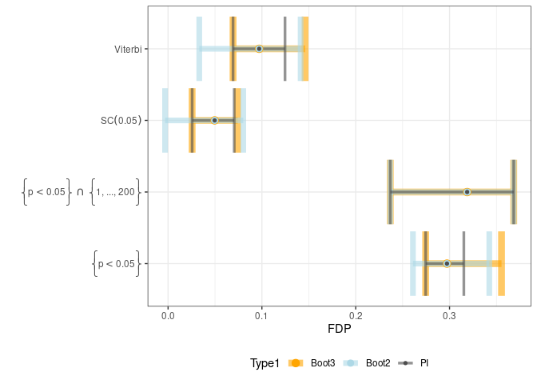

This package provides confidences bounds on the false discovery
proportion after a post selection, under a Hidden MArkov Model settings.

Introduction
------------

In this scenario we observe a series of *m* mesures
$X\_1,\\dots,X\_m \\in\\R$ comming from a law depending on hiden states
*θ*<sub>1</sub>, …, *θ*<sub>*m*</sub> ∈ {0, 1}. In our settings
*θ*<sub>*i*</sub> = 0/1 for the absence / presence of a given signalat
the position *i* of the series.

Our goal is to provide an confidences bounds at levels 1 − *β* of
$$
FDP(S(X))= \\sum\_{i\\in S(X)} \\frac{(1-\\theta\_i)}{\|S(X)\|},
$$
for any $S\\subseteq \\Nm:=\\{1,\\dots,m\\}$. This quantity is the
number of position in *S*(*X*) where there is no signals, this will be
call in the remaining of this vignette the number of false positive.

Install the package
-------------------

``` r
devtools::install_github("Marie-PerrotDockes/hmm.sanssouci")
```

``` r
library(tidyverse)
```

    ## ── Attaching packages ─────────────────────────────────────── tidyverse 1.3.0 ──

    ## ✓ ggplot2 3.3.3     ✓ purrr   0.3.4
    ## ✓ tibble  3.1.0     ✓ dplyr   1.0.5
    ## ✓ tidyr   1.1.3     ✓ stringr 1.4.0
    ## ✓ readr   1.4.0     ✓ forcats 0.5.1

    ## ── Conflicts ────────────────────────────────────────── tidyverse_conflicts() ──
    ## x dplyr::filter() masks stats::filter()
    ## x dplyr::lag()    masks stats::lag()

``` r
library(hmm.sanssouci)
```

\#\# A first example

In this toy example we have *m* = 2000 simulations and we assume that
the hypothesis are naturally ordered. For instance in a setting of test
betwen two groups along the genome. We have statistics
*x*<sub>*i*</sub>, for 1 ≤ *i* ≤ *m*, *x*<sub>*i*</sub> can be a
statistics comparing the DNA copy number at position *i*. The law of *x*
depend of the *θ*.

``` r
m <- 2000
theta <- sim_markov(m, Pi = c(0.8,0.2), A = matrix(c(0.95, 0.05, 0.2, 0.80), 2, 2, byrow = T))
x <- rep(0, m)
x[theta == 0] <- rnorm(sum(theta ==0))
x[theta == 1] <- rnorm(sum(theta ==1), 2, 1)
```

The package provides an upper function to calculate different bounds
available in our article and a function ploting the main bounds proposed
in the article.

``` r
Final <- sanssouci.hmm(x, al= 0.1, sel_function = Selection_delta) 

plot_IC(Final)
```



One can also add simulation studies.

``` r
Test <- simu_delta( m = c(1000),
                    A = matrix(c(0.95, 0.05, 0.2, 0.80), 2, 2, byrow = T),
                    Pi = c(0.95, 0.05),
                    rho = c(0),
                    SNR = 2,
                    prob = c(0.5),
                    type_sim = c("HMM"),
                    n_boot = 20,
                    al = 0.2, s_dbnr = 10, b_act = 2, d = 1, seuil= 0.05,
                    min_size = 2, norm = TRUE, sd0 = 0.5, m0= 0,sd0_init = 0.5, m0_init= 0,
                    norm_init = TRUE, df= 2, num_seed= 1234, type_init="given", f0_known=TRUE,
                    approx = TRUE, delta = 0.9)
```
